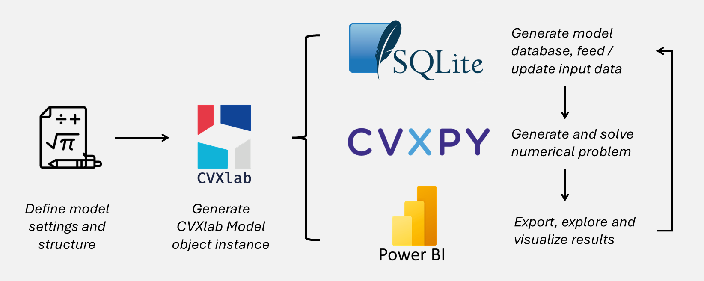

CVXlab documentation
====================

.. warning:: 
  **Beta Release Notice**

  CVXlab is currently in beta (|version|). The API is subject to change before 
  the stable 1.0.1 release. Documentation is under active development. We welcome 
  feedback and bug reports via `GitHub Issues <https://github.com/cvxlab/cvxlab/issues>`_.

**CVXlab - Open-source Python laboratory for convex algebraic modeling**

**Version:** |version|
**Date:** |today|

**Useful Links:**
- `PyPI Page <https://>`_
- `Source GitHub Repository <https://github.com/cvxlab/cvxlab>`_
- `Issue Tracker <https://github.com/cvxlab/cvxlab/issues>`_

Package features
----------------

CVXlab provides an efficient pipeline and a set of tools for defining, managing
and solving numerical optimization problems. Its main features are summarized below:

- **General-purpose model generator**: CVXlab enables to define a wide range of convex 
  optimization problems, as well as nonlinear problems handled as sequence of convex 
  problems (i.e. decomposed into coupled convex subproblems), solving them iteratively 
  using a block Gauss-Seidel (alternating optimization) scheme. Numerical problems
  parametric analysis is also supported and made easy.

- **Almost no code required**: mathematical problems settings based on Excel or 
  yaml files, data collection based on Excel spreadsheets, and problem expressions 
  defined literally as they are written on paper. Users can focus on the modeling 
  of the problem rather than on programming issues. Very low coding skills are required,
  consisting in few lines of Python code to call the main package APIs.

- **Centralized data management based on SQLite databases**: model data are arranged 
  in a SQLite database (`SQLite documentation <https://sqlite.org/index.html>`_), 
  which allows to easily store, retrieve, and manage datasets for optimization 
  problems. Database structure enables to easily visualize and analyze results 
  through Business Intelligence tools (e.g. PowerBI).

- **Powerful engine embedded**: numerical problems generated and solved based on 
  CVXPY, a convex optimization modeling library for Python (see `CVXPY documentation 
  <https://www.cvxpy.org/tutorial/intro/index.html>`_ for a comprehensive description
  of the package capabilities).

CVXlab expand the capabilies of existing algebraic modeling frameworks, such as 
*CVXPY*, *pyGAMS*, *JuMP* or *Pyomo*, providing a full pipeline for the modeling 
process, from the problem definition to the solution and results analysis, with 
a special focus on *centralized data management* and *user-friendliness*. 
This makes CVXlab particularly suitable for practical applications in engineering 
and economics, where data are often scattered and not organized, and users may not
have strong programming skills. Moreover, this framework *standardizes* and *simplifies*
the modeling process, making it more *reproducible*, *understandable* and *less 
error-prone*, especially regarding data handling.

CVXlab in a nutshell
--------------------

The figure below provides a synthetic and simplified overview of the CVXlab modeling 
process.

.. _fig:cvxlab_in_a_nutshell:

In generating and handling a CVXlab model, the user must follow the five fundamental
activities summarized below:

- The user **defines the model settings** and the related structure: model scope, 
  structure of variables, and list of mathematical expressions, including equalities,
  inequalities and (eventually) objective function. 
- The user proceeds by **generating a CVXlab Model object**, consisting in a *Python* 
  class instance embedding all the model settings and the methods useful to manage 
  the model. At the same time, other items are generated, including the **SQLite 
  database file** (to store all model data), and the Excel files serving as blank 
  templates for collecting exogenous data from the user. 
- The user **feeds input data** to SQLite database through blank Excel template 
  files. Specifically, user defines the data input required to characterize exogenous 
  model variables.
- The **numerical problem is generated**, exogenous data fetched from the database, 
  and the problem is solved through CVXPY engine.
- If problem is successfuly solved, **results are finally exported** to the database.
  Due to the structure of the relational database, it can be easily linked and 
  inspected via Excel or SQL queries, or imported into Business Intelligence tools 
  (such as *PowerBI* or *Tableau*) for more elaborated data visualization and analysis.

.. toctree::
   :maxdepth: 1
   :caption: Documentation contents:

   installation
   user_guide
   tutorials
   api_reference
   resources
   changelog.md
   contributing.md

.. note::
   - CVXlab has conceived and developed by *Matteo V. Rocco*, Associate Professor 
     at *SESAM group*, `Department of Energy, Politecnico di Milano 
     <https://www.energia.polimi.it/en/>`_, Italy. For any questions, suggestions
     or feedback, feel free to reach out via email: |author_email|.
   - CVXlab is an open-source project based on the `Apache License Version 2.0, 
     (January 2004) <http://www.apache.org/licenses/>`_. Contributions and feedback 
     are welcome!

