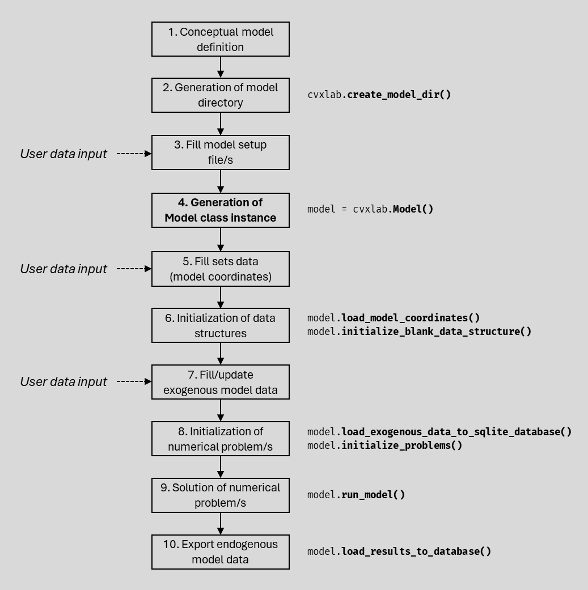
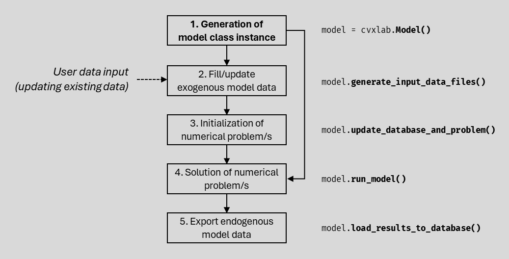

.. _user_guide:

User Guide
==========

This section provides a comprehensive guide to using CVXlab for conceptualizing,
generating and solving optimization problems. This includes all the necessary 
steps to :ref:`generate a model from scratch <model_generation_from_scratch>`, 
or to :ref:`generate it from existing settings/data <model_generation_from_existing>`. 
At the end of the section, a set of :ref:`utilities <utilities>` is provided
to facilitate model properties and data inspection, saving and loading of model 
instances, refreshing model database.

Before diving into each single step, it is suggested to read all this page, which 
provides a synthetic but comprehensive overview about the CVXlab modeling workflow.

A Jupyter notebook is available as a tutorial of the process. See: :ref:`resources-tutorial`

.. _model_generation_from_scratch:

Model generation from scratch
-----------------------------

The CVXlab modeling workflow for generating a model from scratch is summarized 
in the figure below, where steps are highlighted and numbered in boxes, while 
expected activities to be performed by the user and APIs provided by CVXlab are
indicated alongside boxes.

.. _fig:cvxlab_workflow_scratch:

Step by step description of the CVXlab modeling workflow:

1. :ref:`conceptual-model-definition`: the whole CVXlab modeling process must be 
   grounded on a solid conceptualization and mathematical definition of the problem 
   to be solved. This step consists in defining the fundamental model 
   structure pen-on-paper (i.e. definition of objective function, constraints, 
   exogenous/endogenous variables). Once the problem is well defined, the CVXlab 
   modeling process can be started.

2. :ref:`generation-of-model-directory`: a model directory is generated based on 
   a predefined template, and it contains all the necessary files to transpose 
   the conceptual model into a CVXlab model instance. Setup files can be generated 
   as *.yml* or *.xlsx* formats, depending on user's preference. Optionally, a 
   *Jupyter notebook* can be created to guide the user through the modeling process.

   API: :py:func:`cvxlab.create_model_dir`
   
3. :ref:`fill-model-setup-files`: the user translates the conceptual model into 
   the setup file/s available in the model directory. This implies defining the 
   following fundamental elements:
   
   - **Sets**
      *Sets* represent the dimensions of the model, defining its scope. Each set is 
      defined by a list of elements (*coordinates*, in the following), used to 
      identify model variables. Each set (and the related coordinates) correponds 
      to a table in the model *SQLite database* that will be generated.
      Sets are defined in a dedicated *yaml* file (or in a tab of the *xlsx* 
      settings file). Coordinates will be defined in separate Excel spreadsheet 
      once the model instance is generated (see :ref:`Fill sets data (model 
      coordinates) <fill-sets-data>`).

   - **Data tables** and related **variables**
      *Data tables* are collections of model data identified by a list of sets. 
      They can be defined either as *exogenous* (independent variables, collecting 
      input data), *endogenous* (dependent variables), or *constants* (fixed values). 
      Each data table corresponds to a table in the model *SQLite database*. 
      Since SQLite database are classified as *relational databases*, data tables
      are automatically linked to the related sets tables by univocal relations. 

      *Variables* are symbolic items pointing to data in data tables: multiple 
      variables can stem from a same data table, assuming different shapes and 
      referring to different subsets of data tables values, depending on how 
      variables are defined and related coordinates are filtered.
      Both data tables and variables are defined in the same yaml file (or 
      Excel tab).

   - **Problems** and related **Expressions**
      *Problems* are collections of *expressions*, the latter defined as symbolic
      equations, inequalities or objective functions. Expressions are defined 
      relying on model *variables*, mathematical *operators* and *user-defined 
      functions*. Multiple problems can be defined in a same model, and 
      could be solved in parallel as independent or integrated problems.
      Problems and the related expressions are defined in a dedicated yaml file 
      (or Excel tab).   

4. :ref:`generate-model-class-instance`: the instance of the Model class is 
   generated through the *Model class constructor*, which translates the 
   information provided by setup file/s into a Python object. The model instance 
   includes all the necessary information and the APIs to generate and to solve 
   numerical problems, and to handle exogenous/endogeous model data.
   
   In case the model is generated from scratch, the model instance generation
   automatically triggers the generation of the Excel file to be filled with
   the sets coordinates (see :ref:`step 5 <fill-sets-data>`).

   Constructor: :py:class:`cvxlab.Model`
 
5. :ref:`fill-sets-data`: the user fills the sets Excel file with the related 
   *coordiates* (i.e. the list of elements defining each set), the related filters
   and aggregations (if any). Once this step is completed, all the necessary 
   information defining the model structure is available, and the data structures
   can be generated.

6. :ref:`data-structures-init`: this step includes fetching sets coordinates to
   the model instance, performing a coherence check to ensure a correct definition
   of variables, and generating the necessary data structures, including:

   - *Blank SQLite database*
      a relational database with set tables and data tables, linked by univocal 
      relations.
   - *Blank Excel input data file/s*
      one or more Excel file/s (depending on user's preference) with normalized 
      exogenous data tables, to be filled by the user in the next step.

   APIs:
      - :py:func:`cvxlab.Model.load_model_coordinates`
      - :py:func:`cvxlab.Model.initialize_blank_data_structure`

7. :ref:`fill-exogenous-data`: user fills the Excel input data file/s with the 
   exogenous data tables values. In case of models with large amount of data, this
   step can be critical, time consuming and highly prone to errors. To facilitate
   this task, CVXlab provides features to limit the amount of data entries to be
   filled (as example: in settings, a default value can be defined for data table 
   entries in case of missing data).
   Once this step is completed, the numerical model can be generated and solved.

8. :ref:`numerical-problem-init`: this step includes fetching exogenous data from
   excel input data file/s to the model SQLite database, loading and validating 
   symbolic problem/s from model settings, and generating the numerical problem/s
   (based on *CVXPY* library).

   APIs:
      - :py:func:`cvxlab.Model.load_exogenous_data_to_sqlite_database`
      - :py:func:`cvxlab.Model.initialize_problems`

9. :ref:`numerical-problem-run`: in this step, the numerical problem/s are solved
   based on user settings, including the adopted solver, the related verbosity level, 
   and other settings.

   API: :py:func:`cvxlab.Model.run_model`

10. :ref:`export-model-results`: in case numerical problem/s have successfully
    solved, numerical results are exported to the endogenous data tables of the 
    SQLite database.

    API: :py:func:`cvxlab.Model.load_results_to_database`

.. _model_generation_from_existing:

Model generation from existing settings/data
--------------------------------------------

The CVXlab modeling workflow for generating a model from existing setup file/s
and data structures is summarized by the figure below, where steps are highlighted 
and numbered in boxes, while expected activities to be performed by the user and 
APIs provided by CVXlab are indicated alongside boxes.

.. _fig:cvxlab_workflow_existing:

Step by step description of the CVXlab modeling workflow:

1. :ref:`generate-model-class-instance`: the instance of the Model class is 
   generated through the *Model class constructor* as the first step, specifying
   that the model relies on existing data (i.e. by passing ``use_existing_data=True`` 
   to the constructor). 
   Beside setup file/s (see :ref:`Fill model setup file/s <fill-model-setup-files>`), 
   other data structures must be present in the model directory, including the 
   sets Excel file filled with the related coordinates (see :ref:`Fill sets data 
   (model coordinates) <fill-sets-data>`), the blank SQLite database (with set 
   tables and data tables, see :ref:`Initialization of data structures 
   <data-structures-init>`), and the Excel input data directory (see :ref:`Fill 
   exogenous model data <fill-exogenous-data>`). 
   
   The Model constructor checks and validate the model directory structure and 
   the presence of all necessary files. Then, it loads the structures of sets,
   data tables and variables in the index, and fetches problems from the setup 
   file/s. Then it loads coordinates from the sets Excel file to the model instance. 
   Finally, it initializes numerical problem/s and fetches exogenous data from the 
   SQLite database. The model instance includes all the necessary information and 
   the APIs to generate and to solve numerical problems, and to handle model data.

   Constructor: :py:class:`cvxlab.Model`

2. :ref:`fill-exogenous-data`: (optional) in this step, user may update exogenous 
   model data in the Excel file/s. This step is especially useful in case of 
   multiple consecutive model runs, where only exogenous data are changed.
   If needed, one or more blank input data file/s can be re-generated from the 
   blank SQLite database with a dedicated API. 

   API: :py:func:`cvxlab.Model.generate_input_data_files`

3. :ref:`numerical-problem-init`: (optional) this step needs to be made in case
   of exogenous data have updated (see :ref:`Fill exogenous model data 
   <fill-exogenous-data>`). It fetches exogenous data from the Excel input data 
   files to the SQLite database, updating data in numerical problem/s variables.

   API: :py:func:`cvxlab.Model.update_database_and_problem`

4. :ref:`numerical-problem-run`: in this step, the numerical problem/s are solved
   based on user settings, including the adopted solver, the related verbosity level, 
   and other settings.

   API: :py:func:`cvxlab.Model.run_model`

5. :ref:`export-model-results`: in case numerical problem/s have successfully
   solved, numerical results are exported to the endogenous data tables of the 
   SQLite database.

   API: :py:func:`cvxlab.Model.load_results_to_database`
   

.. _utilities:

Utilities
---------

During the modeling process, or once the model is generated and solved, the user 
may need to inspect model properties, or doing some basic operations on the database.
CVXlab provides a set of utilities to facilitate these tasks, including:

*Model properties* can be inspected, including sets, data tables, variables, problems 
and expressions. This is especially useful to check that the model has been correctly 
defined and generated.

- :py:attr:`cvxlab.Model.sets`: list of model sets keys
- :py:attr:`cvxlab.Model.data_tables`: list of model data tables keys
- :py:attr:`cvxlab.Model.variables`: list of model variables keys
- :py:attr:`cvxlab.Model.is_problem_solved`: indicates the status of the numerical problem
      
*Detailed model features* can be inspected through dedicated methods.

- :py:func:`cvxlab.Model.set`: allows to inspect a specific set, including 
  the related coordinates and other attributes.
- :py:func:`cvxlab.Model.variable`: allows to inspect a specific variable, 
  including the related data table, shape, filters and other attributes.
   
*Other helper methods* allow to perform basic operations on the model instance 
and on the SQLite database.

- :py:func:`cvxlab.Model.reinitialize_sqlite_database`: allows to re-generate 
  a blank SQLite database, based on the current model structure (i.e. sets 
  and data tables). This is useful in case the user wants to reset all data 
  in the database, to be sure the database is starting from a clean status.
- :py:func:`cvxlab.Model.check_model_results`: allows to compare the model 
  SQLite database with a reference SQLite database, to check that results 
  are coherent with expected values.

.. toctree::
   :maxdepth: 1
   :hidden:
   :caption: Modeling workflow steps

   user_guide_steps/conceptual_model_definition
   user_guide_steps/model_directory_generation
   user_guide_steps/fill_model_setup_files
   user_guide_steps/generate_model_instance
   user_guide_steps/fill_sets_data
   user_guide_steps/data_structures_init
   user_guide_steps/fill_exogenous_data
   user_guide_steps/numerical_problem_init
   user_guide_steps/numerical_problem_run
   user_guide_steps/export_model_results

